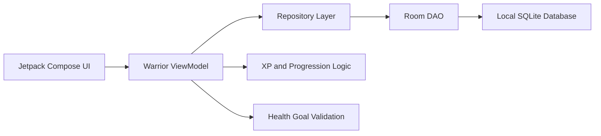

# AI-Assisted Fitness Companion

> Public case study. The app is functional and still under active development. The full source code is private while the product evolves.

## Summary

AI-Assisted Fitness Companion is an Android fitness application focused on gamified progress, workout tracking, health-safe goals and local user data management.

The app was built from an AI-assisted prototyping workflow and evolved into a functional Android project with Jetpack Compose, Room persistence, ViewModel state management and tests around critical health logic.

## Problem

Many fitness apps create friction for beginners:

- Too much manual input.
- Punitive calorie tracking.
- Poor motivation loops.
- Weak personalization.
- No guardrails around unhealthy goals.
- Progress is often shown as numbers, not behavior.

The goal was to create a more engaging app that uses game-like progression while keeping health constraints explicit.

## Solution

The app combines:

- Onboarding profile capture.
- Local health and workout persistence.
- XP-based progression.
- Workout logging.
- Calorie estimation.
- Rank progression.
- Health-goal validation.
- A visual mobile UI built with Jetpack Compose.

## Architecture

## Core Features

- Profile onboarding.
- Local user profile storage.
- Workout set logging.
- XP progression system.
- Rank and progress visualization.
- Calories burned estimation.
- BMI/IMC health-goal validation.
- Local Room database.
- Database migrations.
- Tests for critical logic.
- Custom visual style and exercise assets.

## Stack

- Kotlin
- Android
- Jetpack Compose
- Room
- ViewModel
- StateFlow
- Gradle
- Robolectric tests
- AI-assisted prototyping workflow

## Safety and Data Principles

- User data is stored locally.
- New users start with zero XP and must enter real progress data.
- Weight goals are validated against a safe BMI/IMC threshold.
- Invalid health targets are blocked in the ViewModel.
- Database schema changes require migrations.

## Technical Highlights

- Reactive UI state with ViewModel and StateFlow.
- Room entities for user profile, workout logs and exercise presets.
- XP system based on workout completion and personal records.
- Validation rules to prevent dangerous weight goals.
- Tests for IMC validation and XP behavior.
- Local-first architecture.

## What I Learned

- How to build a functional Android app from prototype to working project.
- How to manage local persistence with Room.
- How to protect health-related logic with validation and tests.
- How to use AI-assisted development while maintaining architecture rules.
- How to turn a product idea into a real mobile application.

## Current Status

- Functional prototype.
- Still under active development.
- Source code private while product logic and UX are refined.

## Future Improvements

- Better onboarding flow.
- AI coach responses.
- Weekly progress reports.
- Exercise recommendation engine.
- Improved animations.
- Exportable progress summaries.
- Optional cloud backup.

## Portfolio Value

This project demonstrates practical experience in:

- Android development.
- Kotlin.
- Mobile architecture.
- Local databases.
- Health-focused validation.
- Gamification.
- AI-assisted product development.
