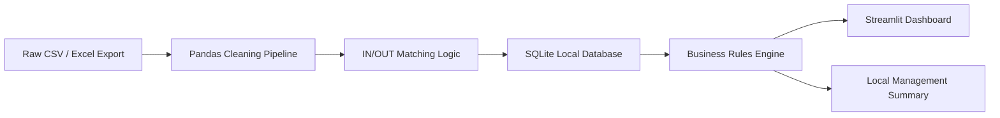

# Smart Time Attendance Dashboard

> Public case study. The full source code is private to protect business logic, client context and implementation details.

## Summary

Smart Time Attendance Dashboard is a local analytics prototype for processing employee time-clock exports, detecting attendance anomalies and generating management-ready summaries without exposing employee data to external services.

The project was originally built as a proof of concept for workshop operations and HR reporting. Company names and operational details have been anonymized.

## Problem

Time-clock systems often export raw CSV or Excel files that are hard to read directly:

- Entry and exit events must be matched manually.
- Missing check-outs create payroll and HR friction.
- Managers need quick KPI summaries.
- Employee data must remain private.
- Manual spreadsheet processing is slow and error-prone.

## Solution

The prototype converts raw time-clock files into a local dashboard:

1. Import CSV/Excel attendance exports.
2. Clean and normalize raw records with Pandas.
3. Match IN/OUT events into work sessions.
4. Store processed records in SQLite.
5. Detect anomalies using business rules.
6. Display KPIs and charts in Streamlit.
7. Generate a local rule-based management summary.

## Architecture

## Features

- Local data processing.
- CSV/Excel ingestion.
- IN/OUT attendance pairing.
- SQLite persistence.
- Anomaly detection for missing exits and irregular work sessions.
- Synthetic data generator for safe demos.
- KPI dashboard.
- Interactive charts.
- Local rule-based summary generation.
- French-language interface in the prototype.

## Stack

- Python
- Pandas
- SQLite
- Streamlit
- Plotly
- Local rule-based "AI" summary module

## Privacy Approach

The prototype was designed around employee data protection:

- Runs locally.
- Uses synthetic data for demos.
- Does not require sending employee data to third-party AI APIs.
- Can be migrated later to a controlled cloud or internal server.

## What I Built

- Data processing pipeline.
- Local SQLite schema.
- Business rules for anomaly detection.
- Synthetic data generator with realistic clock-in variance.
- Streamlit dashboard.
- Management summary module.
- Prototype documentation and executive presentation.

## What I Learned

- How to turn raw operational files into usable business information.
- How to design with privacy constraints.
- How to build a demo without real employee data.
- How to explain a technical prototype to non-technical stakeholders.
- How to separate data processing, business rules and dashboard layers.

## Future Improvements

- Authentication and role-based access.
- Multi-site support.
- Secure deployment.
- Optional anonymized LLM summaries.
- Exportable HR reports.
- Integration with payroll or planning systems.

## Portfolio Value

This project demonstrates practical experience in:

- Python data automation.
- Dashboard development.
- Business process digitization.
- Privacy-conscious design.
- Local-first analytics.
- HR operations tooling.
